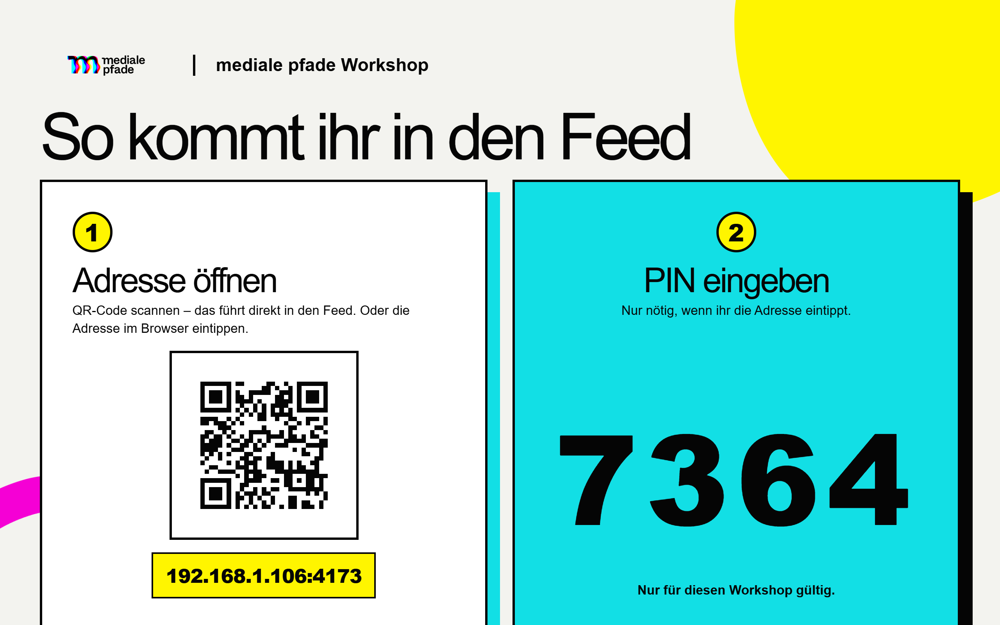
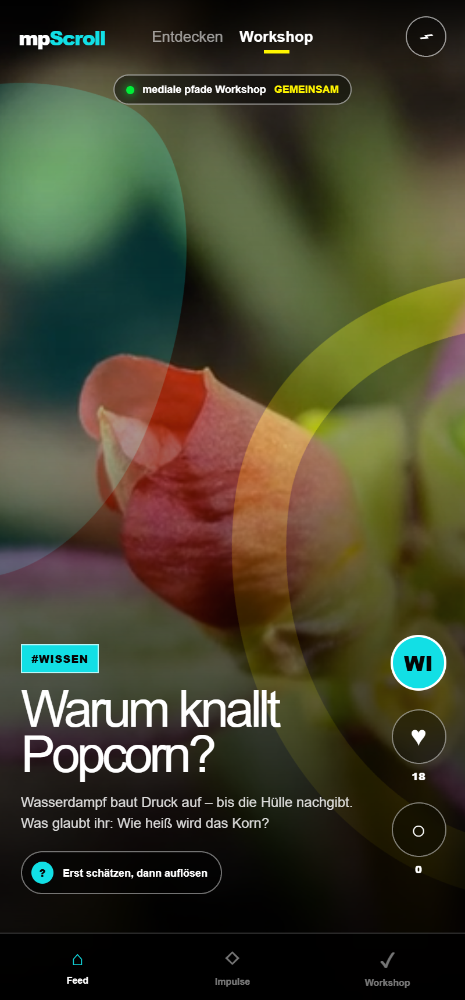
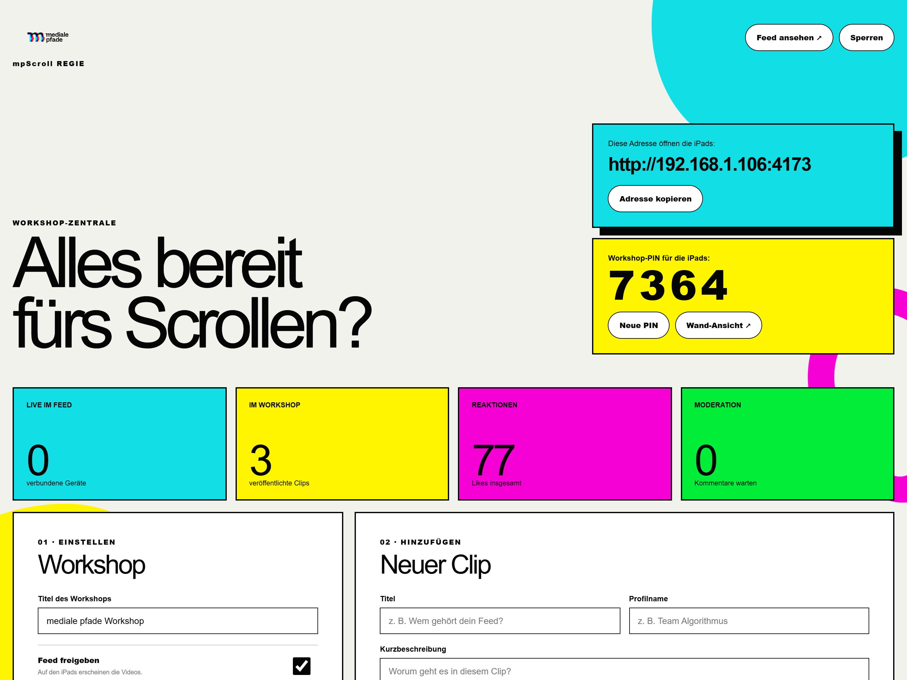

# mpScroll – Workshop-Kit

Ein kuratierter Kurzvideo-Feed im TikTok-Stil für Medienpädagogik-Workshops.
Die Workshop-Leitung pflegt Clips und moderiert Kommentare über eine
Regie-Oberfläche, die Teilnehmenden scrollen auf ihren iPads. Alles läuft
**lokal im eigenen WLAN**. Keine Cloud, keine Konten.

<table>
  <tr>
    <td width="34%"></td>
    <td width="66%"></td>
  </tr>
  <tr>
    <td align="center"><em>Feed auf dem iPad</em></td>
    <td align="center"><em>Regie am Laptop</em></td>
  </tr>
</table>

## Schnellstart

Voraussetzung: [Node.js](https://nodejs.org) 22 oder neuer.

1. **Starten** – Windows: `STARTEN-WINDOWS.cmd` · Mac: `STARTEN-MAC.command`
   (oder im Terminal `npm start`).
2. Die **Regie** öffnet sich im Browser. Mit der Regie-PIN `2468` anmelden,
   Clips hochladen (MP4/WebM, Hochformat 9:16), Feed freigeben.
3. Die **Wand-Ansicht** (`http://localhost:4173/wand`) an den Beamer geben.
   Die iPads scannen den QR-Code – das führt **direkt** in den Feed.

Beim ersten Start ggf. den Firewall-Zugriff fürs private Netzwerk erlauben.
Auf dem Mac muss `STARTEN-MAC.command` einmal per Rechtsklick → Öffnen erlaubt
werden (bei Bedarf `chmod +x STARTEN-MAC.command`).

## Zwei PINs

| PIN | wofür | Schutz |
|---|---|---|
| **Regie-PIN** (`2468`) | Steuerung am Laptop | Die Regie ist **nur über localhost** erreichbar – andere Geräte im WLAN können sie nicht öffnen. Änderbar über `MPSCROLL_PIN`. |
| **Workshop-PIN** | iPads betreten den Feed | Wird zufällig erzeugt, steht auf der Wand-Ansicht, in der Regie jederzeit neu erzeugbar. |

Kommentare erscheinen nie automatisch – sie werden erst nach Freigabe in der
Regie sichtbar. Teilnehmende geben keine Namen oder E-Mail-Adressen an.

## Grenzen & Technik

Jede*r startet das Kit **lokal auf dem eigenen Laptop**; die iPads verbinden
sich im selben WLAN. Realistisch gleichzeitig: **~20–30 iPads** (Laptop per
Kabel am guten WLAN-6-Access-Point), **~10–20** bei reinem WLAN. Der
Flaschenhals ist fast immer das WLAN, nicht der Server. Als öffentlich
gehosteter Internet-Dienst ist das Kit nicht gedacht.

Reines Node.js ohne Abhängigkeiten (auch der QR-Code wird offline erzeugt).
Alle Uploads und Einstellungen liegen nur im Ordner `data/` auf dem Laptop.
